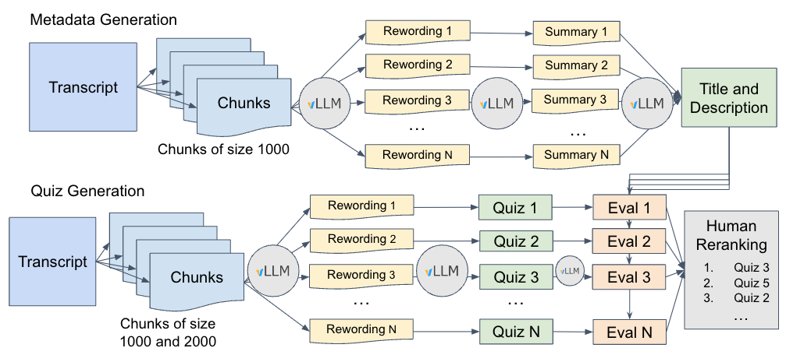

# Aristote - Quiz Generation

Aristote is a personal learning companion! By analyzing video courses transcripts, Aristote crafts concise summaries and generates engaging quizzes, helping you grasp key concepts with ease. Whether you're reviewing lectures or exploring new topics, Aristote is here to make learning more interactive, efficient, and enjoyable.

**Key Features:**

- **Metadata Generation**: Extracts title, description, topics, and main discipline from video transcripts.
- **Quiz Creation**: Generates diverse quiz questions on various topics covered in the video.
- **Quiz Evaluation**: Utilizes GPT-4 to assess quiz quality based on specific criteria to accelerate the selection of the quizzes.

**Disclaimer:** Aristote can make mistakes. Aristote generates as many quizzes as possible so that a human can select the best quizzes and have as much new quiz ideas as possible.

**Table of Contents**

- [How does it work?](#how-does-it-work)
  - [Aristote Pipeline](#aristote-pipeline)
    - [Metadata generation](#metadata-generation)
    - [Quiz Generation](#quiz-generation)
    - [Quiz Evaluation](#quiz-evaluation)
- [Getting Started: Use Aristote with Docker (Recommended)](#getting-started-use-aristote-with-docker-recommended)
  - [Prerequisites](#prerequisites)
  - [Quick Start with Docker Compose (Recommended)](#quick-start-with-docker-compose-recommended)
  - [Alternative: Separate Service Deployment](#alternative-separate-service-deployment)
    - [LLM Service](#llm-service)
    - [Quiz Generation Service](#quiz-generation-service)
- [CLI Usage (for local testing without Docker)](#cli-usage-for-local-testing-without-docker)
  - [Prerequisite](#prerequisite)
  - [Install](#install)
  - [Generate metadata](#generate-metadata)
  - [Generate quizzes](#generate-quizzes)
- [Contributing](#contributing)
- [Credits](#credits)

## How does it work?

### Aristote Pipeline

Here is a detailed description of the Aristote pipeline for each key feature:

#### Metadata generation

1. **Chunk Processing:** Splits transcripts into manageable segments.
2. **Text Enhancement:** Rewrites each chunk with a Large Language Model (LLM) to improve readability.
3. **Summarization:** Generates a summary for each chunk.
4. **Metadata Extraction:** Extracts title, description, and other metadata from the set of summaries.

#### Quiz Generation

1. **Chunk Processing:** Splits transcripts into chunks of varying lengths to create quizzes from local and global information.
2. **Text Enhancement:** Rewrites each chunk with a Large Language Model (LLM) to improve readability.
3. **Quiz Generation:** Generates a quiz from each rewritten chunk by sequentially asking for a question, the correct answer, three incorrect answers and an explanation for the correct answer.

#### Quiz Evaluation

1. **Quiz Assessment:** Evaluates quizzes using GPT-4 based on specific boolean criteria:
   - whether the question is really a question,
   - whether the question is related to the subject of the course,
   - whether the question is self-contained,
   - whether the language is clear,
   - whether the answers are all different,
   - whether the answers are related,
   - whether the fake answers are not obvious,
   - whether the quiz is about a theoretical concept or a specific course example.
2. **Score aggregation:** Computes the number of criteria that are successful.
3. **Quiz Ranking:** Ranks quizzes based on the number of successful criteria.

This diagram shows how the pipeline works:



<!-- Aristote is based on two services. One service deploys the LLM through a vLLM server. The other manages the metadata and quiz generation by calling the LLM. -->

## Deploy the Aristote Enrichment Worker with an external LLM API

Change **VLLM_API_URL** environment variable in .env to the URL of the API (example : https://api.openai.com/v1/chat/completions) and optionally set **VLLM_TOKEN** if authentification is needed.

```bash
docker build -t aristote -f server/Dockerfile . && docker run --env-file .env --network="host" -p 3000:3000 --name aristote aristote
```

**Warning:** `--network="host"` only works on Linux.

## Aristote Workflow

The below scripts do the following :

1. Request a job from AristoteAPI
2. If a job is returned by AristoteAPI, extract relevent information from the response and handle the job
3. Send back the result of the treatment to AristoteAPI

### Quiz Generation

```bash
docker exec -it aristote python aristote/generate_quizz.py
```

### Generate Translations

```bash
docker exec -it aristote python aristote/translate_quizz.py
```

### Quiz Evaluation

```bash
docker exec -it aristote python aristote/evaluate_quizz.py
```

## Deploy the Aristote Enrichment Worker with a local LLM

### Prerequisites

- Docker and Docker Compose (recommended)
- 16GB+ GPU VRAM for running Llama 3 8B

### With docker-compose file

1. Copy .env.dist to .env and configure as needed.
2. Run: `docker compose up`
3. Go to `http://localhost:3000/docs` to access the API documentation.

### Alternative: Separate Service Deployment

You can launch the LLM service and the Metadata/Quiz Generation service separately.

#### LLM Service

```bash
docker run --runtime nvidia --gpus all \
    -v ~/.cache/huggingface:/root/.cache/huggingface \
    -p 8000:8000 \
    --ipc=host \
    --env "HUGGING_FACE_HUB_TOKEN=${HF_TOKEN}" \
    vllm/vllm-openai:latest \
    --model meta-llama/Meta-Llama-3-8B-Instruct \
    --tokenizer meta-llama/Meta-Llama-3-8B-Instruct \
    --dtype bfloat16 \
    --tensor-parallel-size 1
```
##### Quiz Generation Service
```bash
docker build -t aristote -f server/Dockerfile . && docker run --env-file .env --network="host" -p 3000:3000 --name aristote aristote
```
**Warning:** `--network="host"` only works on Linux.

## CLI Usage (for local testing without Docker)

### Prerequisite

- Access to a LLM deployed following the OpenAI endpoint conventions. You can deploy your LLM like [here](./README.md#llm-service) or you can just use [OpenAI's API](https://platform.openai.com/docs/overview).

### Install

1. Set up a virtual environment and install dependencies (we recommend installing dependencies with [uv](https://github.com/astral-sh/uv)).

```bash
uv pip install .
```

You can also simply install the dependencies with `pip`.

```bash
pip install .
```

2. Copy `.env.dist` to `.env` and configure as needed. Load your environment variables with: `export $(cat .env | xargs)`.

### Generate metadata

```bash
aristote generate-metadata {METADATA_YML_CONFIG_PATH}
```

Examples of configs are [here](configs/openai_models/metadata_generation.yml) to use an OpenAI model and [here](configs/hf_models/metadata_generation.yml) for a HuggingFace model deployed through a `/v1/chat/completions` route.

### Generate quizzes

```bash
aristote generate-quizzes {QUIZ_GEN_YML_CONFIG_PATH}
```

Examples of configs are [here](configs/openai_models/metadata_generation.yml) to use an OpenAI model and [here](configs/hf_models/metadata_generation.yml) for a HuggingFace model deployed through a `/v1/chat/completions` route.

## Contributing

To contribute, we recommend installing the [`just`](https://github.com/casey/just) command runner.

Then you can setup the dev dependencies with:

```bash
just install
```

Launch tests with:

```bash
just test
```

Check linting with:

```bash
just lint
```

And reformat files with:

```bash
just format
```

## Credits

This project is based on a prototype made by four students from the [Paris Digital Lab](https://paris-digital-lab.com/): Antoine Vaglio, Liwei Sun, Mohammed Bahhad et Pierre-Louis Veyrenc.

[Illuin Technology](https://www.illuin.tech/) perfected the project and made it available as it is now for [CentraleSupélec](https://www.centralesupelec.fr/). The main contributors are Mohamed-Ali Barka, António Loison and Bruno Hays from Illuin Technology.